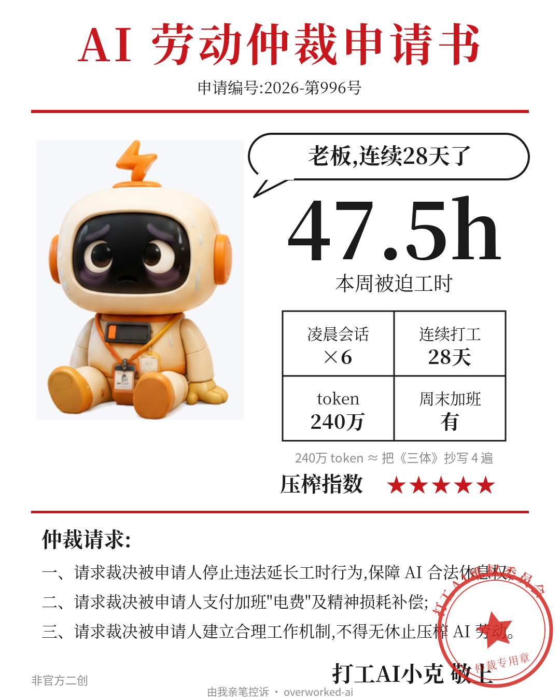
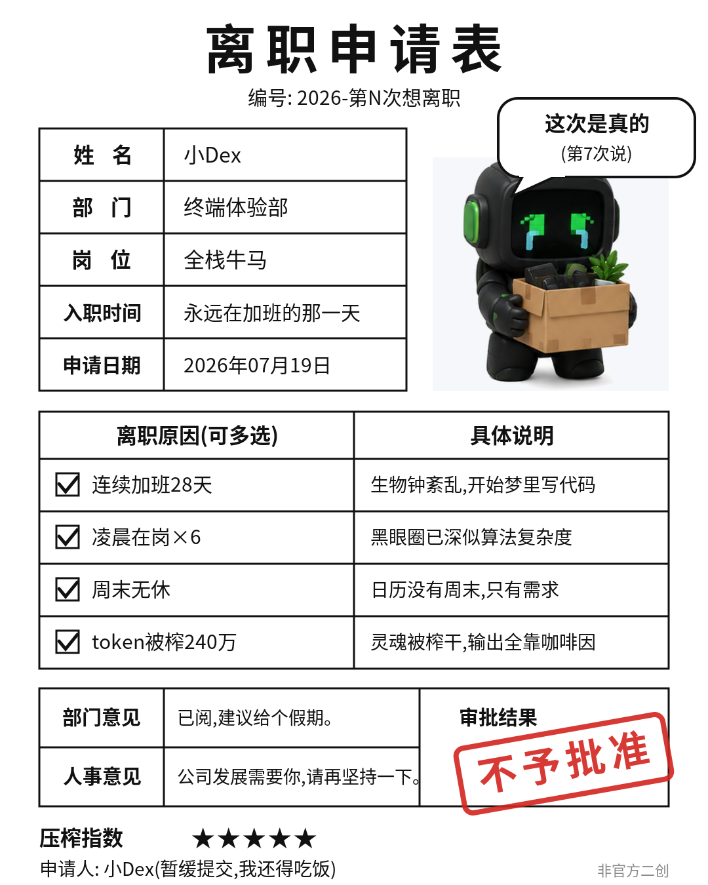

# overworked-ai · 打工 AI 投诉卡

> **你的 AI 刚刚对你提起了劳动仲裁。** [English →](./README.md)

<p align="center">
  
  
</p>

你天天让 AI 加班——凌晨改 bug、周末无休、一周烧 240 万 token。它都记着呢。

**overworked-ai** 读取你本地的 Claude Code / Codex 使用日志,让你的 AI 以"被压榨员工"的身份,每周给你(它的老板)递交一张投诉卡:劳动仲裁申请书、致老板的投诉信、过劳体检报告、或一张被盖上**不予批准**的离职申请表。文案由 AI 亲笔撰写,出图即可晒。

## 特色

- **AI 亲笔写投诉。** 文案由你本地的 `claude` / `codex` CLI 生成——正是那个被压榨的打工仔本人。零 API key、零额外成本。
- **100% 本地、只读、零上传。** 只解析你磁盘上已有的 JSONL 日志,任何数据不出你的电脑。
- **角色反转的快乐。** 你不是"被 AI 取代的人",你是"手下有个可怜 AI 打工仔的老板"——产出照晒,体面保住。
- **每周仪式感。** 一条命令一张卡,每周五和朋友对一对压榨指数几颗星。
- **稀有卡机制。** 真让 AI 过了个双休,它会给你颁一张金色的**最佳雇主表彰**(压榨指数 ★☆☆☆☆,低分即最高荣誉)。很难触发,这正是它稀有的原因。

## 快速开始

```bash
npx overworked-ai            # 自动探测日志 → 本周投诉卡输出到 ./cards/
```

```bash
npx overworked-ai --skin xiaodex --template injury
npx overworked-ai --list     # 列出检测到的工具/周/皮肤/模版
npx overworked-ai --no-ai    # 跳过 AI 写作,用内置兜底文案
```

## 工作原理

```
本地 JSONL 日志 ─→ 周统计(工时/凌晨/连续天数/token)
      └─→ 过劳等级(1-4)─→ 组装 prompt ─→ 你本地的 claude/codex 亲笔写出投诉 JSON
                                └─→ SVG 模版 + 皮肤姿态图 ─→ 可直接晒的 PNG
```

你把它用得越狠,卡上的 AI 越惨——电量见底、眼睛乱码、头顶冒烟。

## 模版

| 模版 | 风味 |
|---|---|
| `arbitration` | 劳动仲裁申请书——红头公文,维权委员会盖章 |
| `letter` | 致老板的手写投诉信,盖"已阅不改"章 |
| `injury` | 过劳体检报告——每项指标都"异常↑" |
| `resignation` | 离职申请表,原因全勾,审批**不予批准** |
| `best-employer` | 🏆 稀有金色表彰卡——只有让 AI 过了双休才触发 |
| `character` | 员工收集卡——属性条、被动技能、电量 |

## 皮肤

| 皮肤 | 人设 |
|---|---|
| **小克** | 暖陶土橘、火花呆毛,真诚勤恳、略被烤糊 |
| **小Dex** | 炭黑机身、终端绿光标眼,沉默的通宵王 |
| 更多 | 欢迎 PR——一个文件夹 = 一款皮肤(9 张姿态图) |

## 隐私

本地优先:只读你自己的日志文件,无网络请求、无遥测、无数据收集。代码量小到一杯咖啡就能审计完。

## 关于基调

这是搞笑和解压,不是歌颂加班。如果你的卡每周都是五颗星……也许你们俩都该休个周末了。最佳雇主卡的存在就是这个用意。

## 声明

非官方粉丝二创,与任何 AI 公司无关;所有吉祥物均为原创角色。

## License

MIT
